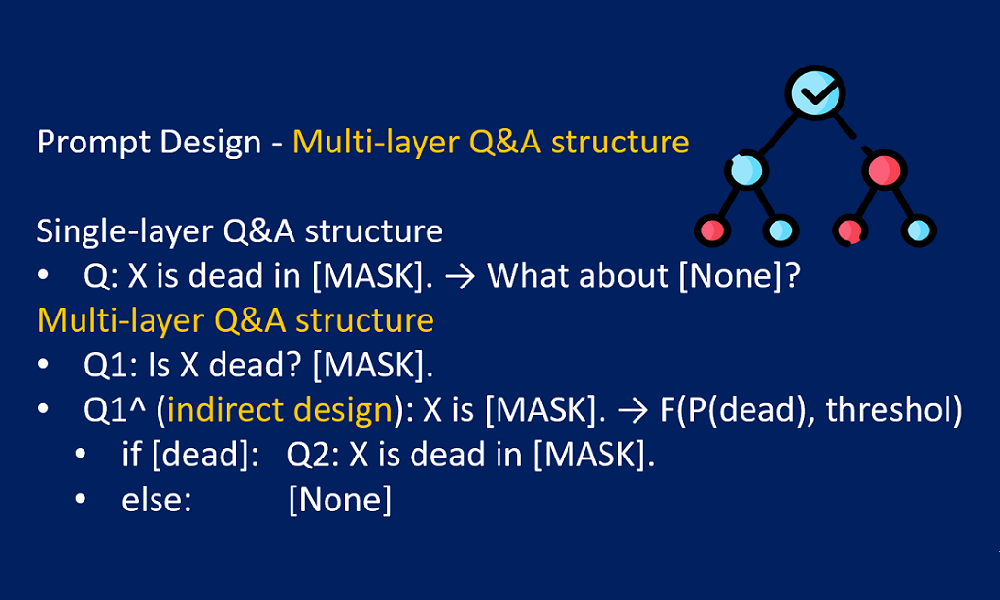
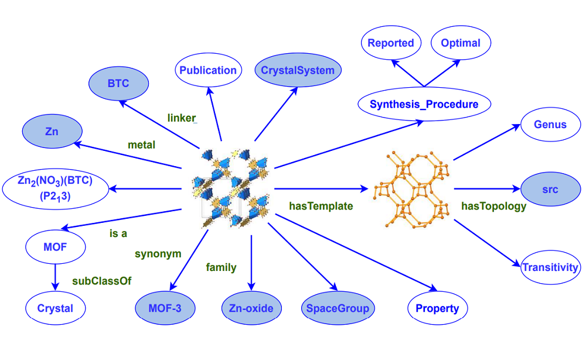








Welcome! My name is 方(Fang) 啸(Xiao). Call me Mike if you like.

I am pursuing my master's degree at the [CSE department of UC San Diego](https://cse.ucsd.edu/). My research interests hold in multiple areas associated with LLMs, from Knowledge Graphs, Adversarial Attack, PEFT (LoRA, P-Tuning), to ML System (Efficient Inference Architecture). I have 2 publications in top AI conferences, with <a href='https://scholar.google.com/citations?user=0bCTNcsAAAAJ'>20 citations</a>.

I worked as a Cloud Engineer at [Oracle Cloud Infrastructure](https://www.oracle.com/cloud/) and participated in the Cloud-Native migration of [Primavera Cloud](https://www.oracle.com/construction-engineering/primavera-cloud-project-management/). Before that, I worked as a Full-Stack Engineer at [Moberg Analytics](https://moberganalytics.com/) and contributed to the early design and development of [CONNECT](https://moberganalytics.com/moberg-connect/) (the predecessor of [Moberg AI Ecosystem](https://moberganalytics.com/moberg-cloud-platform/)).

Besides, I completed my undergraduate at [Drexel University](https://drexel.edu/cci/) and awarded as the [Outstanding Research Assistant](https://drexel.edu/cci/student-experience/awards-scholarships/#:~:text=OUTSTANDING%20RESEARCH%20ASSISTANT%20AWARD) of 2023.

# 🔥 Updates

- *2024.09*: &nbsp;🎉 Joined UC San Diego! La Jolla is awesome 🐳
- *2024.06*: &nbsp;🎉 Graduate from Drexel. Bye Philly 👋
- *2023.12*: &nbsp;🎉 Awarded as the annual Outstanding Research Assistant at Drexel CCI ✨

# 💻 Experiences

- *2023.10 - 2024.04*, [Oracle Cloud Infrastructure](https://www.oracle.com/cloud/), **Cloud Software Engineer**, Philadelphia.
- *2023.09 - 2024.06*, [Drexel University](https://drexel.edu/cci/), **Teaching Assistant**, Philadelphia.
  - INFO101 - Intro to Computing Technology
  - INFO210 - Database Management Systems
  - INFO323 - Cloud Computing and Big Data
- *2022.09 - 2023.04*, [Moberg Analytics](https://moberganalytics.com/), **Full-Stack Engineer**, Philadelphia.
  - Speaker, Multimodal Report Mining Proposal, *2022.11* ([slides](/docs/multimodal_report_analysis.pptx))
  - Speaker, Developer Troubleshooting Tools & Experience Workshop, *2023.04*
- *2022.08 - 2023.05*, [Drexel University - CCI](https://drexel.edu/cci/), **Research Assistant**, guided by Professor [Yuan An](https://cci.drexel.edu/faculty/yan/), Philadelphia.
  - [*Prompt Design and Answer Processing for Knowledge Base Construction from Pre-trained Language Models*](https://ceur-ws.org/Vol-3274/paper5.pdf). ISWC 2022.
  - [*Exploring Pre-Trained Language Models to Build Knowledge Graph for Metal-Organic Frameworks*](https://ieeexplore.ieee.org/document/10020568). IEEE Big Data 2022.
- *2020.06 - 2020.09*, [HFUT - Network Security Center](https://en.hfut.edu.cn/), **Network Operation Assistant**, Hefei.

# 📖 Educations

- *2024.00 - 2025.12 (anticipate)*, [UC San Diego](https://cse.ucsd.edu/), Master of Computer Science. 
- *2021.09 - 2024.06*, [Drexel University](https://drexel.edu/cci/), Bachelor of Data Science & Computer Science.
  - Member, [Data Science Research Club](https://drexel.edu/cci/research/research-areas/data-science/)
  - A. J. Drexel Scholarship, *2021 / 2022 / 2023*
- *2019.09 - 2023.06*, [Lanzhou University](https://xxxyen.lzu.edu.cn/), Bachelor of Computer Science & Engineering.
  - Honors Student Scholarship, *2019 / 2020*

# 🎖 Honors
- [Outstanding Research Assistant Award](https://drexel.edu/cci/student-experience/awards-scholarships/#:~:text=OUTSTANDING%20RESEARCH%20ASSISTANT%20AWARD), Drexel University, College of Computing and Informatics, *2023*
- [Knowledge Base Construction Challenge using Language Model (LM-KBC), Second Prize](https://drexel.edu/cci/news/2022/August/drexel-cci-undergrad-doctoral-students-place-in-international-semantic-web-challenge/), *2022*
  - Guest Presenter, [ISWC 2022](https://dblp.org/db/conf/kbclm/lmkbc2022.html), *2023.01* ([slides](/docs/LM-KBC_Team_From_Drexel.pptx))
- Provincial Prize, [China Mathematical Contest in Modeling](https://en.mcm.edu.cn/html_en/section/b77a1402496e05863c96de6120931806.html), *2020*

# 📝 Publications 

  

    

      
ISWC 2022

      
    

  

  

[Prompt Design and Answer Processing for Knowledge Base Construction from Pre-trained Language Models](https://cci.drexel.edu/faculty/yan/publications/kbc-lm-2022-drexel.pdf)

***Xiao Fang**, Alex Kalinowski, Haoran Zhao, Ziao You, Yuhao Zhang, Yuan An*

The ISWC-2022 challenge on Knowledge Base Construction from Pre-trained Language Models (KBC-LM) provides 12 pre-defined relations. Given a (SubjectEntity, relation) pair, we predicted none, one, or many ObjectEntitys to complete the pair as a triple. The test results on unseen (SubjectEntity, relation) pairs showed our prompt design achieved 49% overall macro average F1-score, a 48% improvement from the baseline’s 31% F1-score. The insights we learned about the “knowledge” of a language model would lead us to select appropriate LMs for future knowledge base construction tasks.

  

  

    

      
IEEE 2022

      
    

  

  

[Exploring Pre-Trained Language Models to Build Knowledge Graph for Metal-Organic Frameworks](https://ieeexplore.ieee.org/abstract/document/10020568/)

*Yuan An, Jane Greenberg, Xiaohua Hu, Alex Kalinowski, **Xiao Fang**, Xintong Zhao, Scott McCLellan, Fernando J Uribe-Romo, Kyle Langlois, Jacob Furst, ...*

We explored a set of SOTA pre-trained general-purpose and domain-specific language models to extract knowledge triples for metal-organic frameworks. We created a knowledge graph benchmark with 7 relations for 1248 published MOF synonyms. Our experimental results showed that domain-specific PLMs consistently outperformed the general-purpose PLMs for predicting MOF related triples. The overall benchmarking results, however, show that using the present PLMs to create domain-specific knowledge graphs is still far from being practical.

  

# 💭 Projects [*- View Full List*](/projects)

  

    

      
IEEE 2022

      
    

  

  

[Exploring Pre-Trained Language Models to Build Knowledge Graph for Metal-Organic Frameworks](https://ieeexplore.ieee.org/abstract/document/10020568/)

*Yuan An, Jane Greenberg, Xiaohua Hu, Alex Kalinowski, **Xiao Fang**, Xintong Zhao, Scott McCLellan, Fernando J Uribe-Romo, Kyle Langlois, Jacob Furst, Diego A Gómez-Gualdrón, Fernando Fajardo-Rojas, Katherine Ardila, Semion K Saikin, Corey A Harper, Ron Daniel*

  

  

    

      
IEEE 2022

      
    

  

  

[Exploring Pre-Trained Language Models to Build Knowledge Graph for Metal-Organic Frameworks](https://ieeexplore.ieee.org/abstract/document/10020568/)

Yuan An, Jane Greenberg, Xiaohua Hu, Alex Kalinowski, **Xiao Fang**, Xintong Zhao, Scott McCLellan, Fernando J Uribe-Romo, Kyle Langlois, Jacob Furst, Diego A Gómez-Gualdrón, Fernando Fajardo-Rojas, Katherine Ardila, Semion K Saikin, Corey A Harper, Ron Daniel

  

  

    

      
IEEE 2022

      
    

  

  

[Exploring Pre-Trained Language Models to Build Knowledge Graph for Metal-Organic Frameworks](https://ieeexplore.ieee.org/abstract/document/10020568/)

Yuan An, Jane Greenberg, Xiaohua Hu, Alex Kalinowski, **Xiao Fang**, Xintong Zhao, Scott McCLellan, Fernando J Uribe-Romo, Kyle Langlois, Jacob Furst, Diego A Gómez-Gualdrón, Fernando Fajardo-Rojas, Katherine Ardila, Semion K Saikin, Corey A Harper, Ron Daniel

  

# 💬 Blogs [*- View Full List*](/blogs)

- *2023.05*, ISWC Guest Speaker 
- *2021.03*, Chrome Debugger Sharing

  

    

      
IEEE 2022

      
    

  

  

[Exploring Pre-Trained Language Models to Build Knowledge Graph for Metal-Organic Frameworks](https://ieeexplore.ieee.org/abstract/document/10020568/)

Yuan An, Jane Greenberg, Xiaohua Hu, Alex Kalinowski, **Xiao Fang**, Xintong Zhao, Scott McCLellan, Fernando J Uribe-Romo, Kyle Langlois, Jacob Furst, Diego A Gómez-Gualdrón, Fernando Fajardo-Rojas, Katherine Ardila, Semion K Saikin, Corey A Harper, Ron Daniel

  

  

    

      
IEEE 2022

      
    

  

  

[Exploring Pre-Trained Language Models to Build Knowledge Graph for Metal-Organic Frameworks](https://ieeexplore.ieee.org/abstract/document/10020568/)

Yuan An, Jane Greenberg, Xiaohua Hu, Alex Kalinowski, **Xiao Fang**, Xintong Zhao, Scott McCLellan, Fernando J Uribe-Romo, Kyle Langlois, Jacob Furst, Diego A Gómez-Gualdrón, Fernando Fajardo-Rojas, Katherine Ardila, Semion K Saikin, Corey A Harper, Ron Daniel

  

