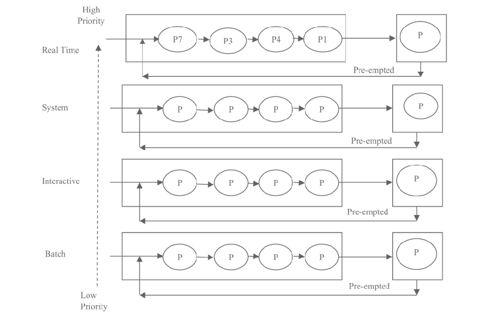
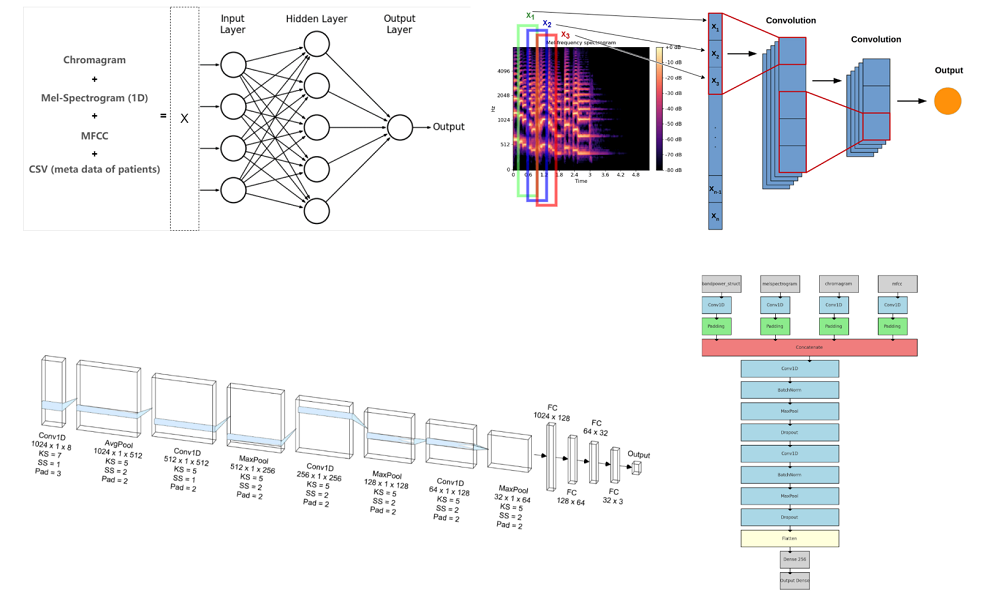
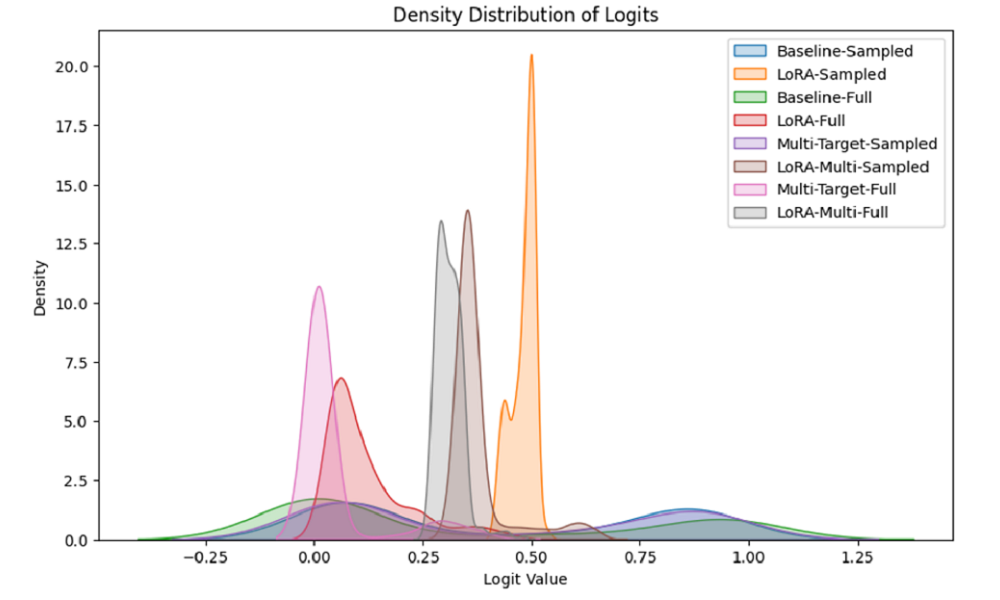

# 💭 Projects [*- View Full List*](/projects)

  

    

      
System

      
    

  

  

  
**Kernel Component Development Based on UMIX** ([code](./))

-Implemented context switching between processes using Yield, enabling efficient time sharing. Developed a user-level multithreading management system, supporting concurrent execution within a single process.

-Designed and implemented multiple scheduling algorithms, including Round Robin, MLQF, and Stride Scheduling. Addressed MLQF starvation through periodic priority resets. For Stride Scheduling, resolved numerical overflow with Pass Normalization and derived the safe upper bound for L-values by numerical analysis, achieving the optimal precision limit.

-Built a synchronization mechanism based on Semaphores, applying it to a single-lane bidirectional-traffic scheduling model, avoiding busy waiting and ensuring minimal average turnaround time.

  

  

    

      
Sequential ML

      
    

  

  

**Deep Learning for Heart Disease Prediction** ([poster](/docs/Poster_Deep_Learning_for_Heart_Disease_Prediction.pdf)\|[report](/docs/Heart_Disease_Prediction_using_Deep_Learning_Methods.pdf))

***Xiao Fang**, Ziao You, Weijie Chen, Yixuan Song, Kan Kim*

-Processed a large-scale dataset (33.5 hours of audio), including filtering out non-heartbeat segments, frequency thresholding, and data augmentation through audio subsetting.

-Derived key audio attributes including Mel-Frequency Cepstral Coefficients (FMCC), band power, chromagram, and Mel-spectrograms, combining them with patient demographics information to provide a richer feature representation.

-Implemented and tested various ML pipelines: MLPs, CNNs, RNNs, and ensemble models. Achieved the highest accuracy with an Voting-MOE MLP pipeline trained on different feature sets (66%) and a CNN trained on concatenated features (64.22%), significantly outperforming the RNN baseline (50%).

  

  

    

      
NLP

      
    

  

  

**Adapting Toxicity Detection from Comments to Conversational Corpus** ([report](/docs/Adapting_Toxicity_Detection_from_Comments_to_Conversations_with_PEFT_and_Knowledge_Distillation.pdf))

-Performed balanced down sampling and conducted fine-tuning experiments on both the imbalanced and sampled datasets for fairness because the lmsys/Toxic-Chat dataset is highly imbalanced, with 92.5% toxic samples.

-Applied Knowledge Distillation (KD) to transfer multi-faceted toxicity evaluation knowledge from the OpenAI Moderation API to the Unitary Toxic BERT model, enhancing model robustness.

-Employed Parameter-Efficient Fine-Tuning with LoRA, reducing the number of updated parameters to only 0.4% of the full-parameter fine-tuning method, while shortening training time by 12%.

-Optimized multi-objective training through hyperparameter tuning, balancing the primary toxicity detection and KD objectives, leading to a 45% F1-score improvement over the pure-PEFT strategy.

  

